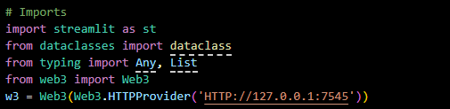
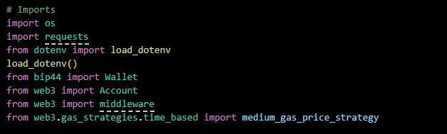
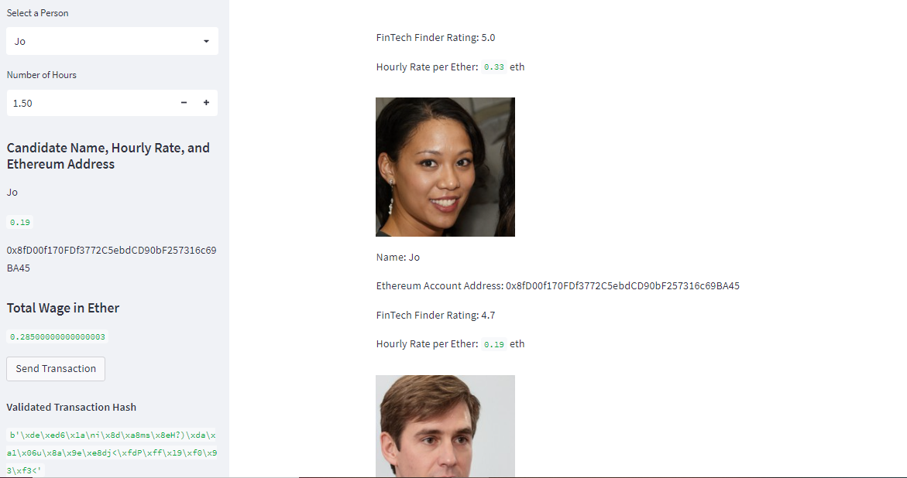
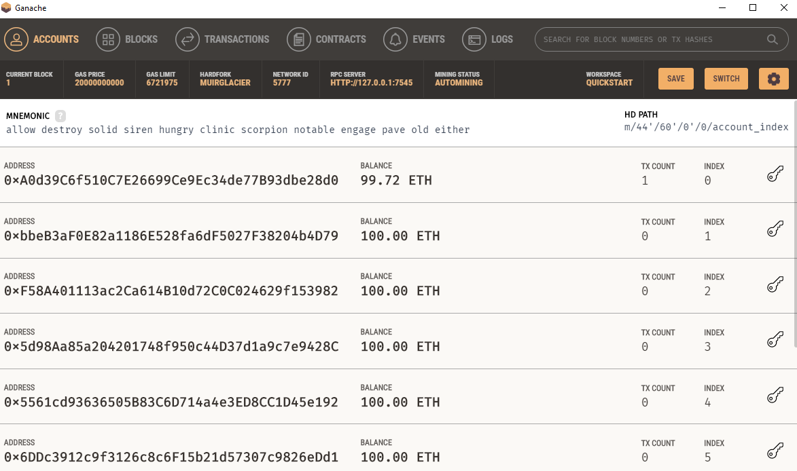
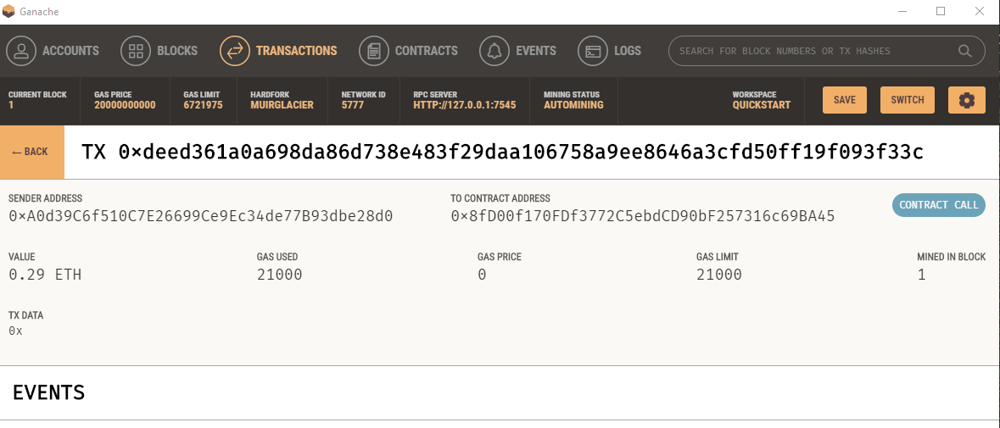

# Fintech_Finder_Project

___

During this week's challenge, I play the role of Lead Developer at a startup that is building a new and disruptive platform called Fintech Finder. Fintech Finder is an application that its customers can use to find fintech professionals from among a list of candidates, hire them, and pay them. The task at hand is to integrate the Ethereum blockchain network into the application in order to enable customers to instantly pay the fintech professionals whom they hire with cryptocurrency.
___

## Technologies

This project leverages python 3.7 with various Libraries and IDE:

* [Streamlit](https://streamlit.io/) - An open-source Python library which enables developers to build attractive user interfaces.

* [Web3.py](https://web3py.readthedocs.io/en/stable/overview.html) - A Python library for connecting to and performing operations on Ethereum-based blockchains.

* [Mnemonic](https://pypi.org/project/mnemonic/) - A Python implementation for generating a 12- or 24-word mnemonic seed phrase based on the BIP-39 standard.

* [bip44](https://pypi.org/project/bip44/) - A Python implementation for deriving hierarchical deterministic wallets from a seed phrase based on the BIP-44 standard.

* [Ganache](https://trufflesuite.com/ganache/) - A program that allows you to quickly set up a local blockchain, which you can use to test and develop smart contracts.

___

## Usage

In order to run this program, one should utilize the terminal or Git Bash and VS Code. The following should be imported:

Additionally, in order to view the code in the web interface, the following code should be run:

Additionally, two files are utilized to facilitate this process:

* crypto_wallet.py
* fintech_finder.py

The crypto_wallet.py file contains the Ethereum Transactions and the fintech_finder.py file contains 
___

## Results

The following are results of the test run on the coding included in the two files listed above:

* I selected a candidate from the pool of four available Fintech Professionals based on their Fintech rating and cost and then sent them a transaction.

* I then ensured the transaction was reflected in the Ganache environment.

* Finally, I also reviewed the transaction in the Ganache transaction environment.

Altogether, the simulation was successful.

___

## Contributors

Franco Thomas - francothomas1989@gmail.com

___

## License

MIT License